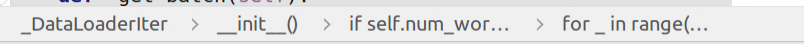
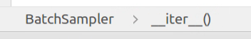
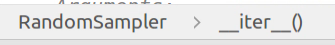

pix2pix pair的训练集准备方法：
datasets/combine_A_and_B.py 把pair的图像拼接到一起（axis=1）变成{A，B}。

到train.py时。
到这一行：for i, data in enumerate(dataset): 会调用aligned_dataset.py把图像切开，返回A和B。

train.py的for i, data in enumerate(dataset):

=>
data/__init__.py的class CustomDatasetDataLoader():的    
def __iter__(self):
        """Return a batch of data"""
        for i, data in enumerate(self.dataloader):
            if i * self.opt.batch_size >= self.opt.max_dataset_size:
                break
            yield data

=>
pytorch的dataloacer.py的class _DataLoaderIter(object):

=>
pytorch的sampler.py的class RandomSampler(Sampler):

=>
aligned_dataset.py
